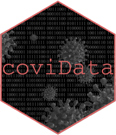

<!-- badges: start -->
  [](https://www.tidyverse.org/lifecycle/#experimental)
[](https://codecov.io/gh/jesse-smith/coviData?branch=master)
[](https://github.com/jesse-smith/coviData/actions)
<!-- badges: end -->
 
# coviData 

coviData is designed to help with ETL, munging, and basic analysis of COVID-19
data within the Shelby County Health Department. It aims to provide a complete
framework for down/loading, cleaning, and summarizing this data. The goal is to
make human input easy when creativity is needed and difficult when consistency
is the priority.

## Installation

You can install the development version of the package using devtools:

``` r
# install.packages("devtools")
devtools::install_github("jesse-smith/coviData")
```

## Code of Conduct

Please note that the coviData project is released with a [Contributor Code of Conduct](https://contributor-covenant.org/version/2/0/CODE_OF_CONDUCT.html). By 
contributing to this project, you agree to abide by its terms.
